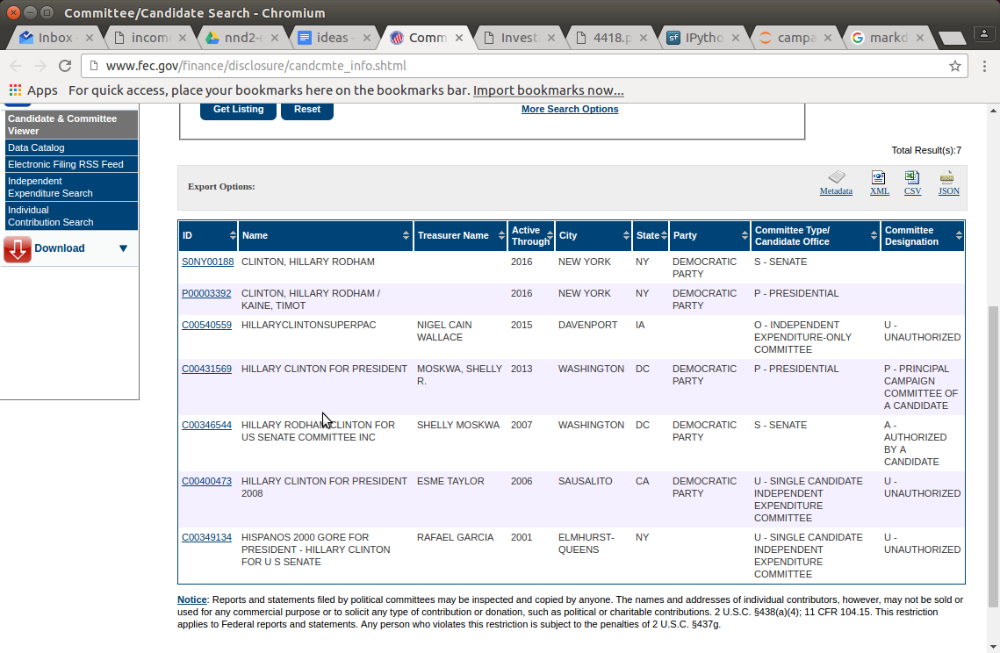
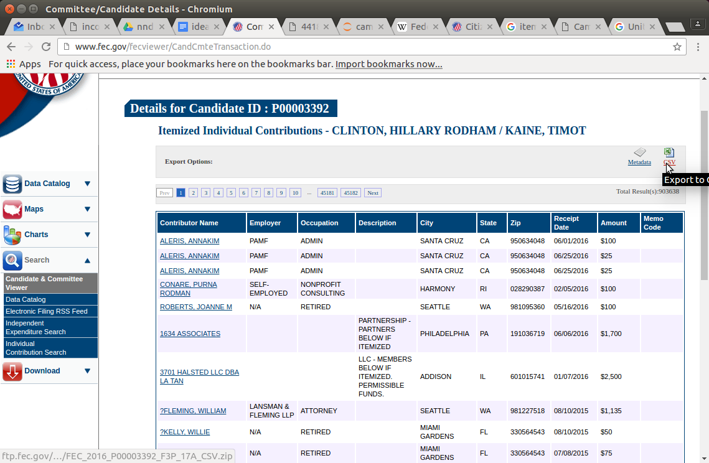
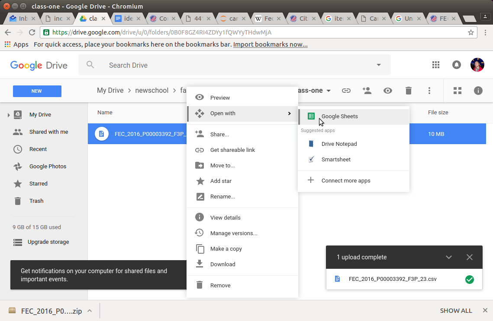
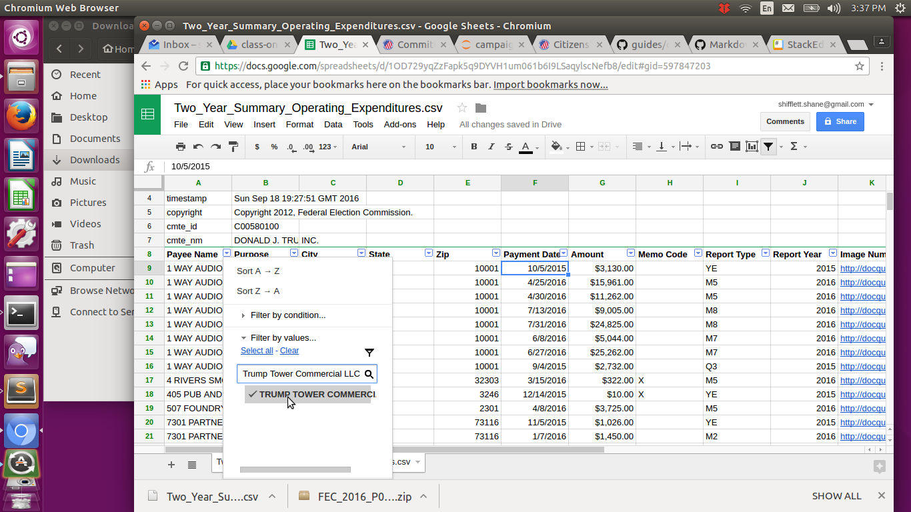
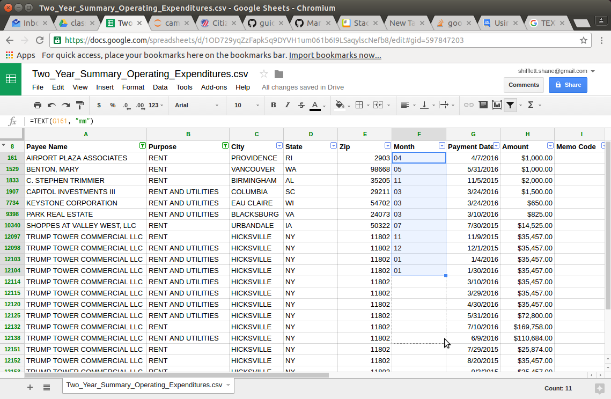
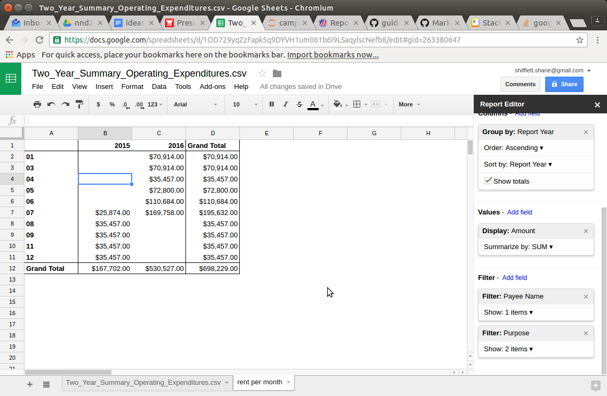

# Covering Campaign Finance: An Intro

## [FEC Online Tool](http://www.fec.gov/finance/disclosure/candcmte_info.shtml)

The Federal Election Commission was created to regulate campaign finance law. They produce reports and data disclosing contributions to **campaign committees** representing candidates running for federal office. This means you can find data for Senate, House of Representatives and Presidential campaigns. You can find other sites, like the [Sunlight Foundation](https://sunlightfoundation.com/tools/), that have parsed FEC data to create tools and searchable databases focused on important topics such as political spendin by organization and industry. You can use the FEC's online tool to:

* Find a summary of a candidate's spending and fund raising
* Easily locate expenses and disburesments and refunds
* Identify contributions made by individuals
* View party committees contributions

There are more exhaustive data sets available requiring a deep understanding cross-table lookups and filing definitions. We'll stick to the reports generated by the FEC using the candidate search tool. You should also read the [Citizen's Guide](http://www.fec.gov/pages/brochures/citizens.shtml) describing what is tracked and what is not. For example, it describes contribution limits:

> Contribution Limits
> An individual may give a maximum of:
 * $2,700 per election to a Federal candidate or the candidate's campaign committee.2 Notice that the limit applies separately to each election. Primaries, runoffs and general elections are considered separate elections.
 * $5,000 per calendar year to a PAC. This limit applies to a PAC (political action committee) that supports Federal candidates. (PACs are neither party committees nor candidate committees. Some PACs are sponsored by corporations and unions--trade, industry and labor PACs. Other PACs, often ideological, do not have a corporate or labor sponsor and are therefore called nonconnected PACs.) PACs use your contributions to make their own contributions to Federal candidates and to fund other election-related activities.
 * $10,000 per calendar year to a State or local party committee. A State party committee shares its limits with local party committees in that state unless a local committee's independence can be demonstrated.
 * $33,400 per calendar year to a national party committee. This limit applies separately to a party's national committee, House campaign committee and Senate campaign committee.
 * $100 in currency (cash) to any political committee. (Anonymous cash contributions may not exceed $50.) Contributions exceeding \$100 must be made by check, money order or other written instrument.
 
You may also need to be able to differentiate between kinds of reports. [The FEC describes the reports and their corresponding codes here](http://www.fec.gov/finance/disclosure/metadata/ReportTypeCodes.shtml).

When you search for a candidate you will may be presented with a candidate's campaign committee from other elections.

>  A committee could be a candidate’s principal campaign committee, a
legislator’s leadership political action committee (PAC) or joint fundraising committee, a PAC for a
corporation or union, or an independent expenditure only committee (sometimes referred to as a Super
PAC). 

> Candidates for political office also receive an ID number from the FEC. These IDs are similar to
committee IDs but are prefixed with P, H or S (rather than C) depending on whether the person is a
candidate for president, the House or the Senate. The FEC assigns multiple IDs to candidates who run
for more than one office

You can download individual contributions by clicking "Itemized Individual Contributions" and clicking "Export CSV"

You can download expenses by clicking "Operating Expenditures" the pressing "Export CSV"

Reports are generated based on filing deadlines which are generally monthly and quarterly. [Link to deadline information](http://www.fec.gov/info/report_dates_2016.shtml). This also does not cover Super-PACs. Use [OpenSecrets](https://www.opensecrets.org/pres16/candidate.php?id=N00000019) for more exhaustive inclusion of a candidate's entire fund-raising operation.

You'll need to download the files and use Google Spreadsheets to explore the data.

### Expenses

* STORY: [Donald Trump Jacked Up His Campaign’s Trump Tower Rent Once Somebody Else Was Paying It](http://www.huffingtonpost.com/entry/trump-campaign-rent_us_57bba424e4b03d51368a82b9)
 * Trump nearly quintupled rent for his campaign HQ at Trump Towers in Manhattan after taking donations
 > The Trump campaign paid Trump Tower Commercial LLC \$35,458 in March
 * Campaign response: Mr. Trump makes a personal contribution of \$2 million per month to the campaign
 > The FEC filings show that Trump began increasing the rent at Trump Tower starting with the May 31 payment of \$72,800. The Trump campaign paid \$110,684 in rent on June 9, and \$169,758 on July 10.

#### Working With Campaign Expenses

After locating Trump's presidental campaign committee and downloading his campaign's expenses, let's check to make sure we're seeing the same data as The Huffington Post did when writing about the amount of rent his business charges his campaign.

* Drag the csv file into Google Drive, right click the file after it uploads and click "Google Sheets"

* Then you can click on the "8" on the far left of the sheet to highlight the entire row. Next click the "Data" dropdown, followed by "Filter." Finally, select the arrow nearest the "Payee Name" column and click "clear" to unselect all the options. Type "Trump Tower Commercial LLC"

* Now filter by rent and date looking for events that occurred on July 10 and June 9

After you found that, let's look at how to find the total amount of money the campaign spent on rent per month on Trump Tower Commercial LLC. We'll use a Pivot Table. But before we can use a Pivot Table we'll need to create at least one new column describing the month the expense using the date of the expense.

* Turn off your filter by navigating to the "Data" dropdown and selecting "Turn off filter."

* Select column F by clicking "F" then right click and select "Insert 1 left." Name this column "Month" and highlight the first cell. 

* Type __=Month(G9)__ (and make sure the column is formatted as a NUMBER)
 * OR Type __=TEXT(G9, "mm")__  This does two things:
  * Enter "function" mode which will allow you to manipulate values in other columns
  * Convert a [date value into a text value into the format you specify](https://support.google.com/docs/answer/3094139?hl=en). Specifically, we want to isolate the value of the month.

* Expand the selection all the way down by hovering over the blue box at the bottom right of your current selection, grab the box and drag it. You can also double click that box and the formula will repeat for every row.

* Now create a pivot table by navigating to the "Data" dropdown and selecting "Pivot Table"

* We want to add up all the expenses related to rent and utilities at "Trump Tower Commercial LLC" for each month.

* Add the "Months" field to the "Row" selection, "Report Year" to the "Columns" selection, "Amount" to the "Values" selection (make sure it is set to "Summarize by SUM"

* Filter by Payee and Purpose...

* Discuss
 * Are any patterns apparent? 
 * How do you make sure the data is accurate?
 * Are any anomalies apparent? How can you investigate them?
 

#### Additional Campaign Expenses Exercises (optional)

* What are five the biggest expense categories?
* What are the top 10 cities for Trump campaign expenses? What is Trump's biggest expense in the city where he spends most of his campaign dollars?
* Download Hilary Clinton's expenses and create a pivot table describing the amount of money spent on rent per month. Share the Google Sheet. How does her campaign's spending on rent compare to Trump's?
