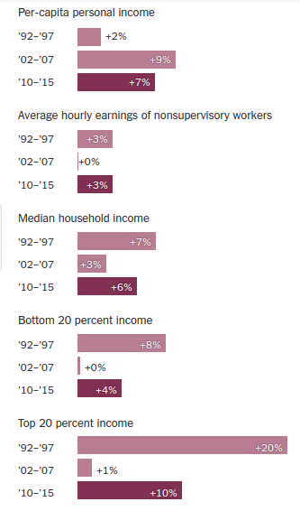
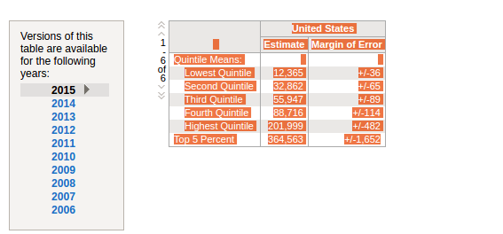
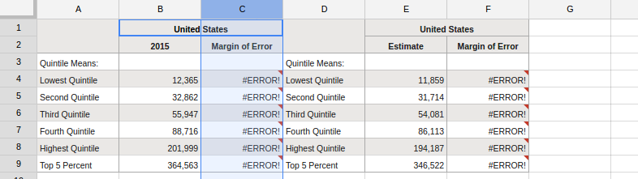
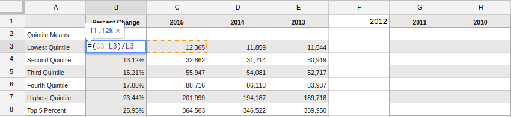
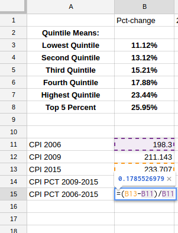

# Measuring Inequality Using The U.S. Census

### Links
* [Portal](http://www.census.gov/topics/income-poverty/income.html)
* [Current Population Survey Table Creator](http://www.census.gov/cps/data/cpstablecreator.html)
* [Fact Finder](http://factfinder.census.gov/faces/nav/jsf/pages/searchresults.xhtml?refresh=t)

## Census Basics

[Various surveys](http://www.census.gov/programs-surveys.html) conducted on differing timelines. Results can be combined for some but not others. The short version:
* Decennial Census - Counts every American possible every 10 years as mandated by the constitution
* American Community Survey - Smaller sample size, more detailed questions on a yearly basis (roughly 2 million households responded in 2014)
* Current Population Survey / Annual Social and Economic Supplement - Even smaller sample conducted more frequently to provide monthly labor force data

### Common Approaches
* [Household Income (Quintiles)](http://factfinder.census.gov/faces/tableservices/jsf/pages/productview.xhtml?src=bkmk)
 * Caveats: A husband and wife each making a modest \$50,000 form one high income household, but divorced they form two middle income households. Thus, median measurements can shift without any change in what people earn. 
* [Poverty Status](http://www.census.gov/did/www/saipe/index.html)
 * [Thresholds are selected by the Census](http://www.census.gov/data/tables/time-series/demo/income-poverty/historical-poverty-thresholds.html) and [may not include the cost of significant household expenditures](http://www.nyc.gov/html/ceo/downloads/pdf/ceo_poverty_measure_2005_2012.pdf).
* [Employement Status](http://factfinder.census.gov/faces/tableservices/jsf/pages/productview.xhtml?pid=ACS_14_5YR_S2301&prodType=table)
 * Different surveys ask [different questions](https://www.census.gov/hhes/www/laborfor/laborguidance092209.html) which can [influence the percentage of people considered in active labor force pool](http://www.bls.gov/cps/cps_htgm.htm#nilf) 
* [Insurance Status](http://factfinder.census.gov/faces/tableservices/jsf/pages/productview.xhtml?pid=ACS_14_5YR_S2701&prodType=table)
 * Healthcare costs vary based on employment status and age.
* [Educational Attainment](http://factfinder.census.gov/faces/tableservices/jsf/pages/productview.xhtml?pid=ACS_14_5YR_S1501&prodType=table)
 * A proxy that suggests quality of life
* [Gini Index (more on this in another talk)](http://factfinder.census.gov/faces/tableservices/jsf/pages/productview.xhtml?src=bkmk)
 * Describes distribution of inequality based on your measures... typically 0 expresses perfect equality and 1 expresses the opposite
 
 
### Recent Coverage On Rising Incomes

Census data released this September showed considerable gains in household income, reduction in poverty and an increase in full-time employment 

[The New York Times](http://www.nytimes.com/2016/09/14/upshot/the-economic-expansion-is-helping-the-middle-class-finally.html)
> The most decisive evidence of improving fortunes is found in new census data released Tuesday showing that median household income rose a whopping 5.2 percent in 2015, to around \$56,500. According to that data, incomes rose for black families, white families, Hispanic families and Asian-American families. It rose for young people and in households headed by middle-aged adults and older people. In short, the improvement was across the board to a remarkable degree.

[The Wall Street Journal](http://www.wsj.com/articles/rising-incomes-juice-consumer-spending-1473798203)
> John Shin and Michelle Meyer of Bank of America Merrill Lynch estimate that roughly 60% of U.S. households spend all of their income. For most of these people additional income translates into additional spending. That is a one reason the consumer has been the biggest thing the U.S. economy has had going for it lately. 

The Upshot story tries to apply additional context... what does it seem to imply?

### How are the gains distributed?

The recent Census report says nothing about how earnings are changing for households in different income brackets. [Other tables](http://www.census.gov/topics/income-poverty/income/data/tables.html) will describe this but we want to view how incomes are distributed so we need to look at tables with data grouped into [quintiles](http://factfinder.census.gov/faces/tableservices/jsf/pages/productview.xhtml?pid=ACS_15_1YR_B19081&prodType=table).

Let's compile a data set to see incomes have changed for households at the bottom 20 percent, 20-40, 40-60, 60-80 and top 20 percent of the income distribution.

* Highlight the table and press CTRL-C to copy the data

* Open a Google Sheet, paste the data by pressing CTRL-V, label "Estimate" as 2015... Repeat process for all years down to 2006. Clean up your data!

* Calculate the percent change in household income, 2006 to 2015

#### Be sure to account for inflation!

Using the [Consumer Price Index](http://www.usinflationcalculator.com/inflation/consumer-price-index-and-annual-percent-changes-from-1913-to-2008/) we can account for the shrinking value of the dollar over time
* Why would we want to do this?
* What does CPI measure?
 * Periodically samples the prices of items that make up a typical household goods / budget
 * See a month of prices: http://www.bls.gov/cpi/cpid1608.pdf
 
 
* Return to the spreadsheet, calculate the percent change in CPI between 2006 and 2015
 

### In class exercises:

* Calculate the 2006-2015 percent change in household income
* Calculate the 2009-2015 percent change in CPI
* Calculate the 2009-2015 percent change in household income
* Discuss: What do our findings indicate?

# Writing a Lede

Three approaches: hard news, anecdotal and conversational. All have the basics (Who, what, why, when (and where if applicable)) but approach them at a different pace.

* [Hard news](http://www.wsj.com/articles/rising-incomes-juice-consumer-spending-1473798203)

> The Census Bureau on Tuesday reported that the income at the median U.S. household—the one at the statistical middle of the middle—rose an inflation-adjusted 5.2% to $56,500 last year from 2014. While still 1.6% below the precrisis level, that marked the biggest annual gain on record. Income inequality eased, with income growing faster for middle class than the rich, and lower-income households improving even more.

* [Anecdotal + nut graph](http://www.pulitzer.org/winners/wall-street-journal-staff)

> Ronald S. Weaver isn't a cardiologist. Yet 98% of the $2.3 million that the Los Angeles doctor's practice received from Medicare in 2012 was for a cardiac procedure, according to recently released government data.
> The procedure is rarely used by the nation's heart doctors. Patients are strapped to a bed with three large cuffs that inflate and deflate rhythmically to increase blood flow through the arteries—a last resort to treat severe chest pain in people who can't have surgery.
> The government data show that out of the thousands of cardiology providers who treated Medicare patients in 2012, just 239 billed for the procedure, and they used it on fewer than 5% of their patients on average. The 141 cardiologists at the Cleveland Clinic, renowned for heart care, performed it on just six patients last year. Dr. Weaver's clinic administered it to 99.5% of his Medicare patients—615 in all—billing the federal health-insurance program for the elderly and disabled 16,619 times, according to the data.

* [Conversational](http://www.nytimes.com/interactive/2016/09/20/upshot/the-error-the-polling-world-rarely-talks-about.html?action=click&contentCollection=upshot&region=rank&module=package&version=highlights&contentPlacement=1&pgtype=sectionfront)

> For years, the standard knock on this economic expansion has been twofold: Growth has been slow, and big businesses and wealthy investors have been its major beneficiaries, rather than middle-class wage earners.
> And it has been a fair criticism. At least until recently.
> The growth rate is still disappointingly slow, but that second part no longer appears to be true. After all these years, the fruits of the recovery are now being delivered more broadly. While all the attention is focused on new census data confirming the change, it is actually a broad range of evidence that makes the case compelling.
The most decisive evidence of improving fortunes is found in new census data released Tuesday showing that median household income rose a whopping 5.2 percent in 2015, to around $56,500. According to that data, incomes rose for black families, white families, Hispanic families and Asian-American families. It rose for young people and in households headed by middle-aged adults and older people. In short, the improvement was across the board to a remarkable degree.

# Homework

Using the data analysis we conducted in class, the Census report or any other new inequality-related data set like [DataUSA](https://datausa.io/profile/geo/new-york-ny), identify a datapoint and write a paragraph about it. Ideally this is your lede paragraph of a story you would pitch.
 
## Notes

[Source data](http://www.census.gov/content/dam/Census/library/publications/2016/demo/p60-256.pdf)

> Real” refers to income after adjusting for 
inflation. All income values are adjusted to 
reflect 2015 dollars. The adjustment is based on 
percentage changes in prices between 2015 and 
earlier years and is computed by dividing the 
annual average Consumer Price Index Research 
Series (CPI-U-RS) for 2015 by the annual average 
for earlier years. The CPI-U-RS values for 1947 
to 2015 are available in Appendix A. Consumer 
prices between 2014 and 2015 increased by 
0.1 percent

Tables:
* Households by total money, 2015 - 1967, race
 * how to calculate percent change
* Selected Measures of Household Income Dispersion: 1967 to 2015
* Number and Real Median Earnings of Total Workers and Full-Time, Year-Round Workers by Sex
and Female-to-Male Earnings Ratio: 1960 to 2015
 * bucket and calculate percent change
* Poverty Status of People by Family Relationship, Race, and Hispanic Origin: 1959 to 2015

Data Caution: [We Gave Four Good Pollsters the Same Raw Data. They Had Four Different Results.](http://www.nytimes.com/interactive/2016/09/20/upshot/the-error-the-polling-world-rarely-talks-about.html?action=click&contentCollection=upshot&region=rank&module=package&version=highlights&contentPlacement=1&pgtype=sectionfront)

